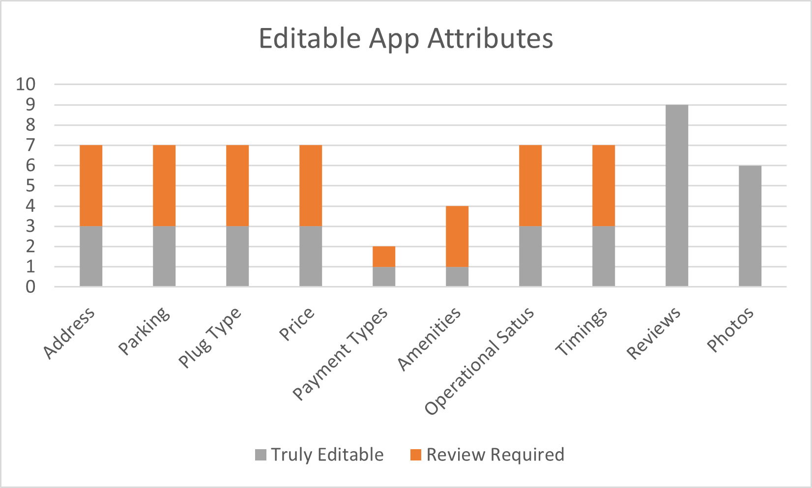

Electric Vehicles adoption is increasing rapidly across the world
including the USA. In this study we take a look at the various security
risks which are posed by crowd sourced electric vehicle charging network
apps and websites.

electric vehicles, charging network, security

Introduction
============

The first modern all electric vehicle to be introduced to the USA was
the Nissan Leaf in 2010. Since then electric vehicle adoption has been
growing steadily from a mere 17,763 EVs sold in 2011 to 326,644 EVs sold
in 2019. A total of 1,444,097 electric vehicles have been sold between
2011 and 2019 @b1. With this increasing adoption of electric vehicles
multiple charging networks have come up all around the United States to
fulfil the ever growing demand for Electric Vehicle charging stations.
But this introduces a new problem as most of the apps and websites
created by these charging networks only show charging stations of their
network. To overcome this problem new crowd sourced apps were created
which allowed users and manufactures to input details of charging
stations as they were set up and also allowed users to update the
details of these stations as the prices and number of plugs available
changed. While some of these apps required a review by an authorized
individual, some of the more popular apps don’t require any review
before changes are published. We will look at the security issues this
causes for an individual and the country as a whole.

Methodology
===========

Searching for Apps and Websites
-------------------------------

To conduct the search for websites we used DuckDuckGo as the search
engine. To automate the search we wrote a python program using the
Selenium and BeautifulSoup libraries. The search terms used for this
study are listed in “Table. [tab0]”. Duplicate links which were found in
the list were removed by the program and the final list of websites was
written to a csv file. The search was 5 pages deep as all of the
relevant links were found in the first 5 pages. The relevant links in
this case were defined as links which contained USA charging networks or
recommendations for USA charging networks. As DuckDuckGo does get an
approximate location information using a GEO::IP lookup most of the data
related to the USA appear in the first few pages. The same search terms
were then used to search for apps on Apple App Store.

[htbp]

  -------------------------------
  EV charging
  EV charging map
  EV charging app
  Electric vehicle charging
  Electric vehicle charging map
  Electric vehicle charging app
  -------------------------------

[tab0]

Identifying editable attributes
-------------------------------

By looking at all the websites and apps which we gathered we created a
list of all the attributes related to the charging stations that could
be edited on the app and websites. We ended up with the list of editable
attributes which is shown in “Table. [tab1]”. To determine which
attributes were editable each website and app was opened and changes
were attempted on each attribute. A record of the original value of each
attribute was also kept. If the attribute was editable and no review was
required, the attribute was reverted back to its original state as had
been previously recorded. To ensure that the impact on the users was as
minimal as possible several precautions were taken. At a given time only
one attribute was edited for a particular charging station. If the
address of the charging station was being changed it was changed only by
one house number and immediately reverted back to the original as was
recorded. If the price was being changed it was changed by one cent and
was immediately changed back to the original value as recorded. All the
edits were as minimal as possible and were performed between 12:00 AM to
02:00 AM local time for the charging station to reduce any chance of
harm to a user. The attributes which do not require any review for
making changes will be considered as truly editable for the purpose of
this study.

[htbp]

  --------------------
  Address
  Parking
  Plug Type
  Price
  Payment Types
  Amenities
  Operational Status
  Timings
  Reviews
  Photos
  --------------------

[tab1]

Classification of websites and apps
-----------------------------------

The websites and apps are also classified into three categories based on
when they get their data from. First are the charging networks. These
are the websites and apps created by the charging networks who install
the charging stations and list their own charging stations. Second we
have the data aggregators. These websites and apps aggregate and display
data of charging stations from multiple charging networks and did not
include data from the crowd sourced websites. Lastly we have the crowd
sourced websites and apps. These websites and apps depend on their users
and the charging networks to update the data they have on the various
charging stations. The classification was very straightforward as we did
not encounter any ambivalent cases.

Popularity of websites and apps
-------------------------------

We used three metrics to determine the popularity of websites and apps.
While running the automated search script we also got multiple articles
which recommended certain websites and apps. The number of mentions of a
particular app or website in an article was used as the first metric to
determine its popularity. For the purpose of this study an article is
defined as a web page which contains verbiage recommending or listing
certain charging network websites or apps. The article should also not
be from the website or company which is recommended or listed in it. In
the web search we also came across multiple sites which used plugins
from certain websites to display charging network data on their
websites. A plugin for the purpose of this study is defines as nested
content provided by a certain website in the form of a code snippet
which can be included in the code of another website to display data of
charging networks. The number of times a plugin from a certain website
was used was used as the second metric to determine popularity. Lastly
the number of ratings and the number of ratings of apps on the Apple App
Store was used as the third metric to determine its popularity.

Limitations
===========

This study focuses on the security of charging networks in the USA. Any
website, app or article which did not pertain to the charging networks
in the USA were ignored for the purpose of this study. To check if a
charging network website or app contained data of charging stations in
the USA each website or app was checked to see if it listed any charging
stations in the USA. Websites or apps which contained data of charging
stations outside the USA along with the data of charging stations in the
USA were also included. This study also looks into apps present on the
Apple App Store due to the unavailability of an android phone to search,
download and test the apps available on Android. Certain websites which
required either a subscription or purchase and registration of a vehicle
to access the data on their charging networks were also ignored due to
budgetary constraints.

Identification of websites and apps
===================================

This study focuses on the security of charging networks in the USA. Any
website, app or article which did not pertain to the charging networks
in the USA as mentioned before were ignored for the purpose of this
study. This study also looks into apps present on the Apple App Store
due to the unavailability of an android phone to search, download and
test the apps available on Android. Certain websites which required
either a subscription or purchase and registration of a vehicle to
access the data on their charging networks were also ignored due to
budgetary constraints.

Search for websites and apps
----------------------------

The automated search for websites using the python script yielded 874
links. After removing duplicate links from the same website we were left
with 598 unique links. Out of these links we selected only the links
pertaining to charging networks in the USA. We found 20 websites with
charging network data, 17 articles recommending certain websites or apps
and 20 websites that used plugins from other websites to display
locations of charging stations.

Classification of websites and apps
-----------------------------------

Out of the 20 websites which were found containing data of charging
networks, 3 were data aggregators, 9 were charging networks and 8 were
crowd sourced websites(Fig. [fig1]). The websites in each category are
listed in “Table [tab2]”. In the 27 apps which were found in the Apple
App Store, 5 were data aggregators, 13 were from charging networks and 9
were crowd sourced(Fig. [fig2]). The apps in each category are listed in
“Table [tab3]”.

[htbp]

|l|l|l| & &\
https://abetterrouteplanner.com/ &
https://na.chargepoint.com/&https://www.plugshare.com/\
https://www.evtripplanner.com/planner/2-8/ &
https://www.evgo.com/find-a-charger/ &
https://afdc.energy.gov/fuels/electricity\_locations.html\
https://evstationslocal.com/ &
https://www.electrifyamerica.com/locate-charger/ &
https://chargehub.com/en/charging-stations-map.html\
& https://blinkcharging.com/drivers/blink-map/ &
https://openchargemap.org/\
& https://voltacharging.com/drivers/ & https://evtripmap.com/\
&

[t]0.5https://www.ford.com/buy-site-wide-content/overlays/try-the-tech/

& https://chargemap.com/map\
&

[t]0.5https://charge.greenlots.com/evowner/portal/locate-charger

& https://www.google.com/maps/search/ev\
& https://tools.greencars.com/charging/ & https://www.evmatch.com/s\
& https://www.flo.com/drivers/map/ &\

[tab2]

[htbp]

  ------------------------------- --------------------------- -------------------------------
  A Better Route Planner (ABRP)   Blink Mobile                Alternative Fueling Stations
  Charge App: EV charging         ChargePoint                 AmpUp - EV Charging
  Chargeway                       Electrify America           ChargeFinder: Public Charging
  Go-Station EV Charging          EVCS                        ChargeHub EV Map
  RechargeNow                     EVgo EV Chargers            Chargemap - Charging stations
                                  EVolution | EV Network      EVmatch
                                  FLO - EV Charging Network   Open Charge Map
                                  Greenlots                   Plug Map
                                  Greenspot EV Charging       PlugShare
                                  PowerFlex                   
                                  SemaConnect                 
                                  Volta Charging              
                                  Xeal                        
  ------------------------------- --------------------------- -------------------------------

[tab3]

[fig1]

[fig2]

Editable attributes
-------------------

Out of the 8 apps which were crowd sourced at least 2 apps with
attributes which were truly editable(Fig. [fig3]). In the case of apps
we had 1 app for each attribute which was truly editable(Fig. [fig4]).

[fig3]

[fig4]

Popularity of websites and apps
===============================

It is important to judge the popularity of the websites and apps as it
gives USA an insight into how serious the issue at hand is by letting
USA know which website or app is more frequented by users.

Popularity in articles
----------------------

Out of the 17 articles which were found in the web search, PlugShare was
the most popular and was mentioned in 16 of the articles(Fig. [fig5]).
The number of mentions of the top 10 websites and apps are listed in
“Table [tab4]”.

[fig5]

[htbp]

  ------------------- ----
  PlugShare             16
  ChargePoint           11
  Google Maps            7
  ChargeHub              6
  Evgo                   6
  Greenlots              6
  Open Charge Map        5
  Electrify America      4
  Chargeway              4
  Chargemap              4
  ------------------- ----

[tab4]

Popularity based on plugin usage
--------------------------------

There were 20 websites which had plugins from other websites. Only 4
websites provided plugins which could be used in other websites. These
websites and the number of websites that use their plugins are listed in
“Table [tab5]”. PlugShare was again the most popular plugin
provider(Fig. [fig6]).

[fig6]

[htbp]

  ------------------------------- ----
  PlugShare                         13
  Alternative Fuels Data Center      4
  Open Charge Map                    2
  ChargeHub                          1
  ------------------------------- ----

[tab5]

Popularity based on App Store ratings
-------------------------------------

As the Apple App Store does not provide data on the number of downloads
of a particular app we used the next closest metric which could be used
to determine the popularity of the app, its ratings and number of
ratings. This is based on the assumption that more the people use an app
the more they would rate it. PlugShare was again the most highly rated
app(Fig. [fig7]). For comparison the Tesla app, an app made by Tesla,
the largest and most popular electric vehicle manufacturer in the USA,
has a rating of only 3.8 with 4000 ratings. The list of the top 5 most
highly rated apps can be found in “Table [tab6]”.

[fig7]

[htbp]

  ------------------------------ ----- -------
  Plugshare                      4.8   51000
  ChargePoint                    4.6   5000
  Evgo                           4.4   1400
  Alternative Fueling Stations   4.7   1300
  ChargeHub EV Map               4.5   275
  ------------------------------ ----- -------

[tab6]

From all the above mentioned analysis we can clearly see that PlugShare
is by far the most popular website and app which is used by Electric
Vehicle users to find charging stations. The editable attributes for
plug share are listed in “Table [tab7]”. All these editable attributes
in PlugShare are truly editable i.e. they can be edited directly without
requiring a review. For comparison all the truly editable attributes of
websites/apps with at least one truly editable attribute are listed in
“Table [tab8]” along with their type\

[htbp]

|l|l|l|l|l|l|l|l|l|l|l|l| & & & & & & & & & &\
PlugShare & Yes & Yes & Yes & Yes & No & Yes & No & Yes & Yes & Yes\

[tab7]

[htbp]

|l|l|l|l|l|l|l|l|l|l|l|l| & & & & & & & & & & &\
AFDC & No & No & No & No & No & No & No & No & Yes & No & Crowd Sourced\
Charge App & No & No & No & No & No & No & Yes & No & Yes & No & Data
Aggregator\
ChargeHub & No & No & No & No & No & No & No & No & Yes & Yes & Crowd
Sourced\
Chargemap & No & No & No & No & No & No & No & No & Yes & Yes & Crowd
Sourced\
ChargePoint & No & No & No & No & No & No & No & No & Yes & Yes &
Charging Network\
Chargeway & No & No & No & No & No & No & No & No & Yes & Yes & Data
Aggregator\
EVmatch & No & No & No & Yes & No & No & No & No & No & No & Crowd
Sourced\
EVmatch & Yes & Yes & Yes & Yes & Yes & No & Yes & Yes & No & No & Crowd
Sourced\
EVTripMatch & Yes & Yes & Yes & Yes & No & Yes & Yes & Yes & Yes & Yes &
Crowd Sourced\
Google Maps & No & No & No & No & No & No & Yes & No & Yes & Yes & Crowd
Sourced\
Greenspot & No & No & No & No & No & No & No & No & Yes & No & Charging
Network\

[t]0.17Open Charge Map

& No & No & No & No & No & No & No & No & Yes & Yes & Crowd Sourced\
Plug Map & Yes & Yes & Yes & Yes & No & No & Yes & Yes & Yes & No &
Crowd Sourced\
PlugShare & Yes & Yes & Yes & Yes & No & Yes & No & Yes & Yes & Yes &
Crowd Sourced\

[tab8]

Security Issues
===============

The editable attributes in the websites and apps can cause some serious
personal and national security issues in the hands of a malicious actor.

Cyber attack on the grid
------------------------

The grid depends on predictions of usage in order to get power plants
inline and offline and to manage supply and demand. Grids can usually
deal with gradual rise and fall in supply and demand without any issue.
But if there is a sudden spike or drop in demand it can put a lot of
pressure on the grid. It can lead to undervolting or overvolting of the
grid if the grid can’t react fast enough to the changes. This can also
cause a change in the frequency of the grid which can cause severe
damage to the grid and anything connected to it. This issue is
highlighted in a paper written by Yury Dvorkin titled “Cybersecurity of
Smart Electric Vehicle Charging: A Power Grid Perspective” @b2. This
issue can be caused if the pricing, availability and locations of
charging networks are edited. This can cause a large number of electric
vehicles to gather in a small area to charge themselves. This can cause
a sudden spike in demand in the local area and can impact the grid
adversely.

Damage to infrastructure
------------------------

The USA infrastructure is in dire need of repair and upgrades. The
American Society of Civil Engineers rates America’s infrastructure as a
C-. Bridges in particular receive a rating of C. Currently, 42% of all
bridges are at least 50 years old, and 46,154, or 7.5% of America’s
bridges, are considered structurally deficient, meaning they are in
“poor” condition. Roads fare worse receiving a rating of D. 40% of the
American road system is in poor or mediocre condition @b3. This problem
will only burgeon with the increase in adoption of electric vehicles. On
an average electric vehicles weigh 1 ton more than their non electric
counterparts. This is really concerning as the average car weighs 1.5
tons and it represents a 66.66% increase in the weight of vehicles @b4.
Editing address, plug type, parking, price, availability and plug type
could redirect electric vehicle traffic over weak and degraded bridges
and roads and can cause damage or collapse of these structures.

Personal Safety
---------------

Unlike traditional cars electric vehicles can’t carry extra fuel for
emergencies and usually require someone to tow them to a charging point
if they run out of charge. As anyone can edit the attributes of a
charging station a bad actor could change attributes of certain stations
to leave someone stranded in an isolated area or lure someone to an
isolated area thus putting the lives of users of these apps at risk.
This could be achieved by editing attributes like address, plug type,
timings and photos.

Conclusion
==========

Electric vehicle adoption is going to increase over the next few years
as we continue reducing our dependence on fossil fuels. But this change
brings along with it new challenges which we have not faced before. We
need to revamp our infrastructure to be able to handle the extra loads
being put on it by electric vehicles. This includes the electricity,
road and bridge related infrastructure. Also ensuring that all the
changes which are made to the charging station data on.

00 Gohlke, David, and Zhou, Yan. Assessment of Light-Duty
Plug-in Electric Vehicles in the United States, 2010 – 2019. United
States: N. p., 2020. Web. doi:10.2172/1642114. S. Acharya, Y. Dvorkin,
H. Pandžić and R. Karri, “Cybersecurity of Smart Electric Vehicle
Charging: A Power Grid Perspective,” in IEEE Access, vol. 8, pp.
214434-214453, 2020, doi: 10.1109/ACCESS.2020.3041074. American Society
of Civil Engineers, United Sates of America, March 04, 2021. Accessed
on: May 10, 2021. [Online]. Available:
https://infrastructurereportcard.org/wp-content/uploads/2020/12/National\_IRC\_2021-report.pdf
Mackenzie, Don & Zoepf, Stephen & Heywood, John. (2014). Determinants of
USA passenger car weight. Int. J. of Vehicle Design. 65. 73 - 93.
10.1504/IJVD.2014.060066.
